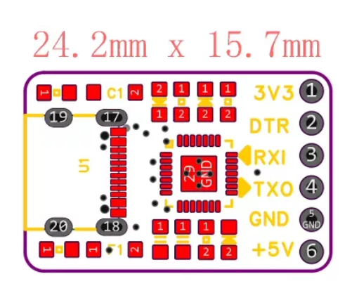
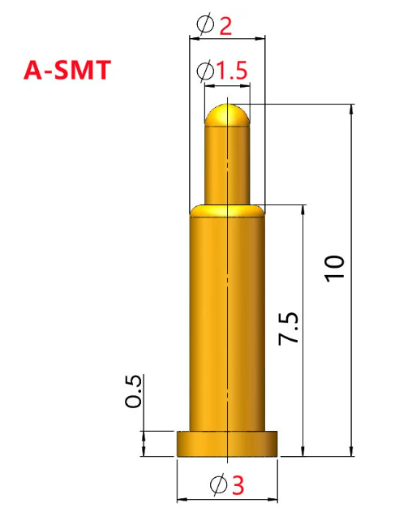
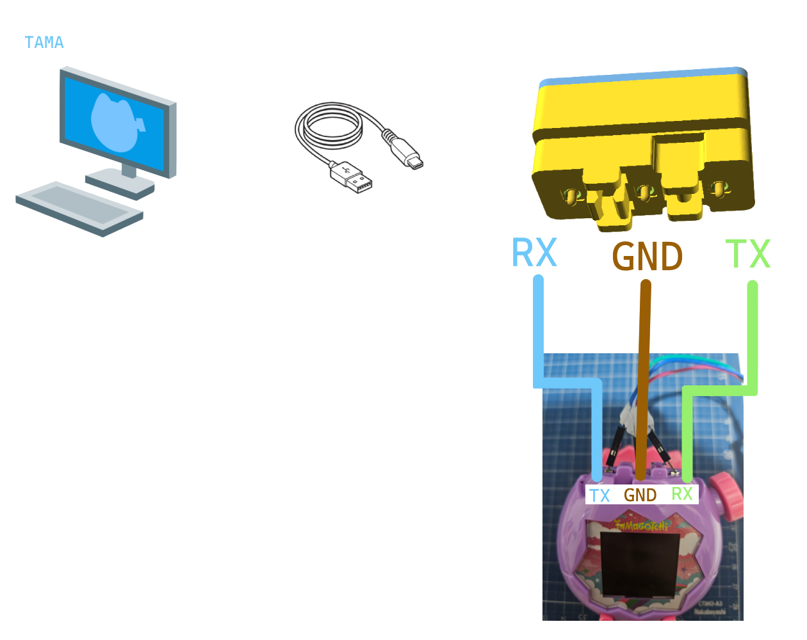

# Tamagotchi Paradise UART Adaptor


## Install OpenSCAD

This project use OpenSCAD script to model the adaptor

```bash
# Windows
winget install -e --id OpenSCAD.OpenSCAD

# MacOS
brew install --cask openscad@snapshot
```

## Generate .stl for 3D printing

`part`: `0` = adapter, `1` = lid. These commands work in Windows PowerShell (no quoted strings).

```powershell
openscad -D part=0 -D show_board_preview=false -D show_pin_preview=false -o adapter.stl tamagotchi-paradise-uart-adaptor.scad
openscad -D part=1 -D show_board_preview=false -D show_pin_preview=false -o lid.stl tamagotchi-paradise-uart-adaptor.scad
```

## Preview

[Adapter](./adapter.stl) · [Lid](./lid.stl) · [Removed Lid with board & pin preview](./docs/preview-no-lid.stl)

## Components

### 1. CP2102 USB to ttl board (USB Type-C)

Remember to [install driver](https://www.silabs.com/software-and-tools/usb-to-uart-bridge-vcp-drivers?tab=downloads)  
  
[Example Retail](https://item.taobao.com/item.htm?id=786109602441&mi_id=0000svrNCbdOST2PhjM6uqnH0rq7CW9Fo-mMpPjtxteKOhM&spm=tbpc.boughtlist.suborder_itemtitle.1.434b2e8dEOzAeG)

### 2. Pogo pins

It used for contact the top portion of the physical connector pins from Tamagotchi Paradise device. Notices that the size does matter.
Here I use A-SMT pin, (flat flange, no tail) with following spec:

```
Ø3 × 0.5 mm flange
Ø2 × 7.0 mm barrel
Ø1.5 × 2.5 mm plunger
10 mm overall.
```

  
[Example Retail](https://item.taobao.com/item.htm?id=836549063705&mi_id=0000gXqq91Ah3jaaENDyuLehYernuiv4zQMBeJ2WHqH3nCw&spm=tbpc.boughtlist.suborder_itempic.d836549063705.62082e8dhEZmYZ)

### 3. Wire for soldering

Any wire (suggest to use 24 AWG) for soldering TX, RX, GND to the pogo pins.

## Connection Scheme

Soldering the pin reference to the following scheme, the left side of the adaptor plug your own USB type-c cable to your PC.



## Special Thanks

This project reference and modified from hook model `./reference-stl/Basic_rev2.stl` [IgelFullmetal](https://www.thingiverse.com/thing:7310297) Creative Common License
