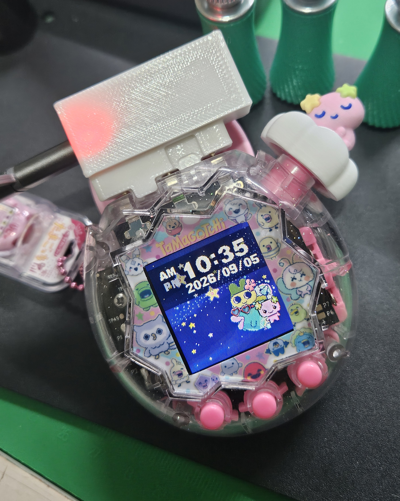
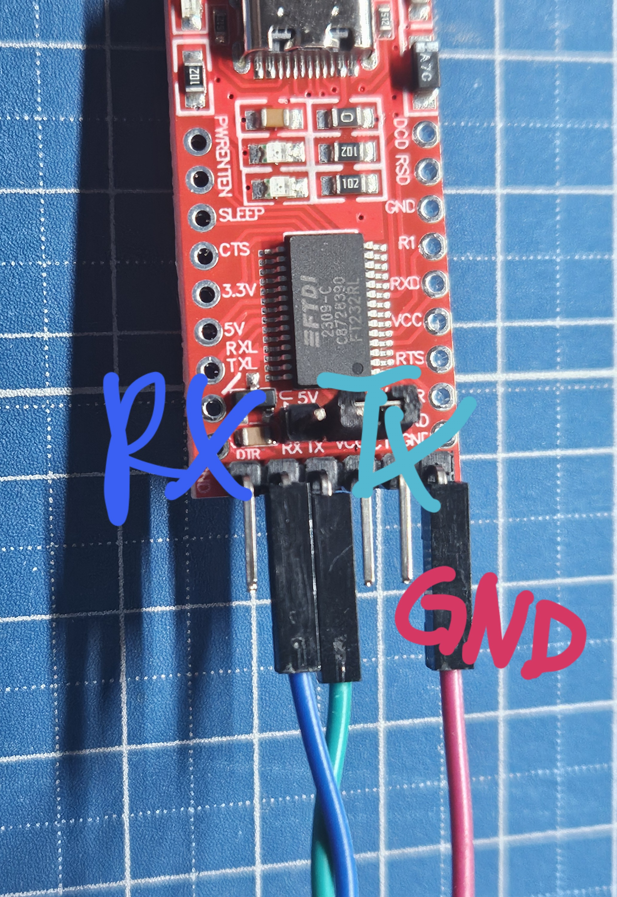
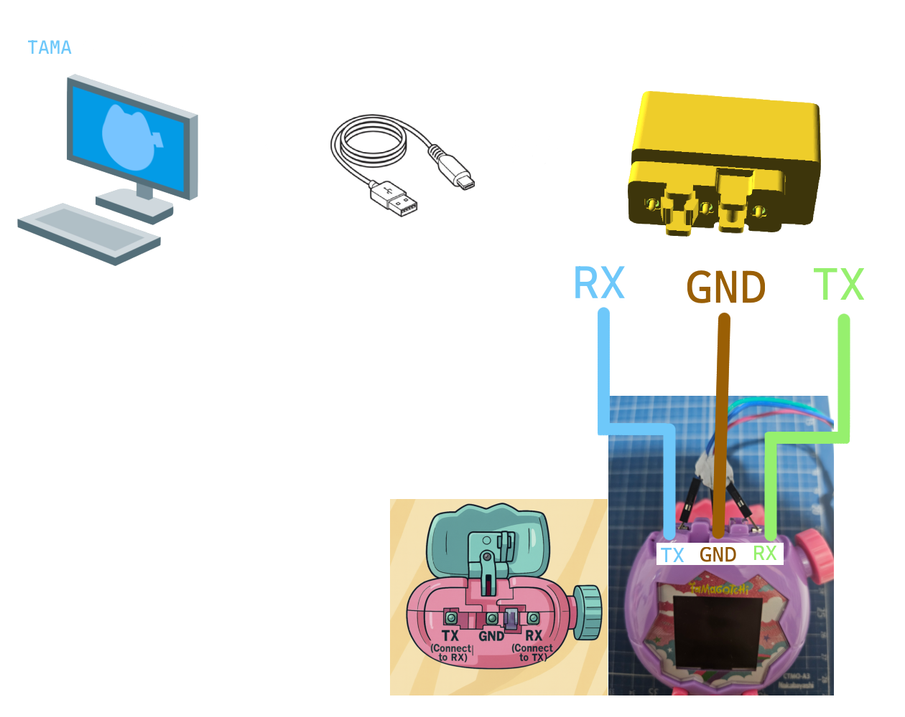
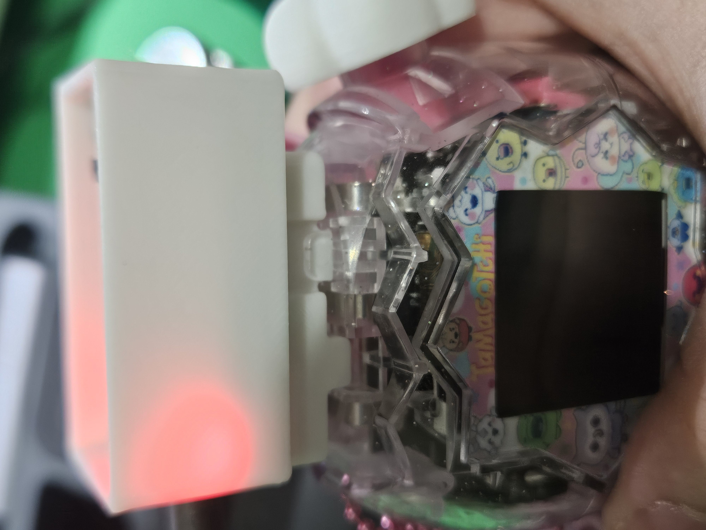
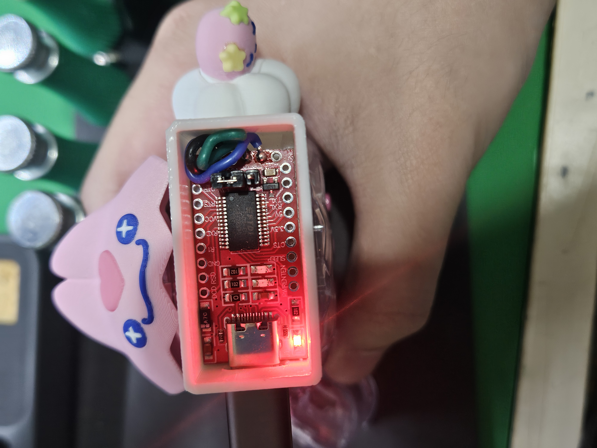
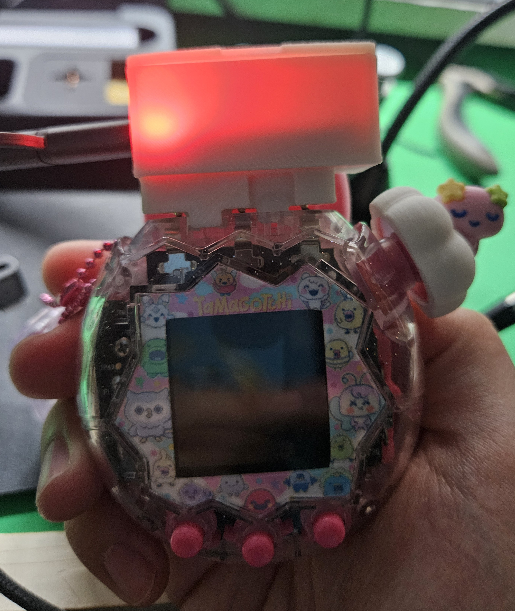

# Tamagotchi Paradise UART Adaptor


<figure>

<figcaption>My adaptor plug to a Tamagotchi Paradise device 💗💖</figcaption>
</figure>

## Introduction

This is a UART adaptor for connecting your personal computer to Tamagotchi Paradise via `USB Type-C` cable.

## Install OpenSCAD

This project use OpenSCAD script to model the adaptor

```bash
# Windows
winget install -e --id OpenSCAD.OpenSCAD

# MacOS
brew install --cask openscad@snapshot
```

## Install just

```bash
# Windows
winget install -e --id Casey.Just

# MacOS
brew install just
```

## Generate .stl for 3D printing

Generate the printable wired adapter and lid:

```bash
just wire
```

Generate the AAA battery holder for the future wireless version:

```bash
just wireless-3a-battery
```

Generate both with `just all`.

## Models

[Wired adapter](./models/wire/wire-adaptor.stl) · [Wired lid](./models/wire/wire-lid.stl) · [Wireless AAA battery holder](./models/wireless/wireless-3a-battery.stl)

## Components

### 1. FTL232RL USB to ttl module (USB Type-C)

<div style="display: flex; gap: 0px;">
  
   
</div>

[Example Retail](https://item.taobao.com/item.htm?from=detail&id=977654905255&mi_id=0000h-JgSDiB4f7Ho-2niVD6hPhUYCVJkwAm0X3ns97yCBI&spm=tbpc.orderdetail.suborder_itemtitle.1.1ac16aa62cI0VB)

🚨🚨🚨 **Tamagotchi Paradise only accept 3.3v for signal, please check your usb to ttl TX is output 3.3v otherwise it can damage your Tamagotchi Paradise device!!!** 🚨🚨🚨

Requirement:

- Tamagotchi Paradise require input signal with 3.3v, otherwise the command will failed / damage your tamagotchi device
- Baud rate need to support 460800

### 2. Pogo pins

It used for contact the top portion of the physical connector pins from Tamagotchi Paradise device. Notices that the size does matter.
Here I use A-SMT pin, (flat flange, no tail) with following spec:

```
Ø3 × 0.5 mm flange
Ø2 × 7.0 mm barrel
Ø1.5 × 2.5 mm plunger
10 mm overall.
```

   
[Example Retail](https://item.taobao.com/item.htm?id=836549063705&mi_id=0000gXqq91Ah3jaaENDyuLehYernuiv4zQMBeJ2WHqH3nCw&spm=tbpc.boughtlist.suborder_itempic.d836549063705.62082e8dhEZmYZ)

### 3. Wire for soldering

Any wire (suggest to use 24 AWG) for soldering TX, RX, GND to the pogo pins.

## Connection Scheme

Soldering the pin reference to the following scheme, the left side of the adaptor plug your own USB type-c cable to your PC.

  

## Gallery
_Model 3D Print in FDM ABS_
<div style="display: flex; gap: 0px;">
  
  

     
</div>

## Special Thanks

This project reference and modified from hook model `./reference-stl/Basic_rev2.stl` [IgelFullmetal](https://www.thingiverse.com/thing:7310297) Creative Common License
